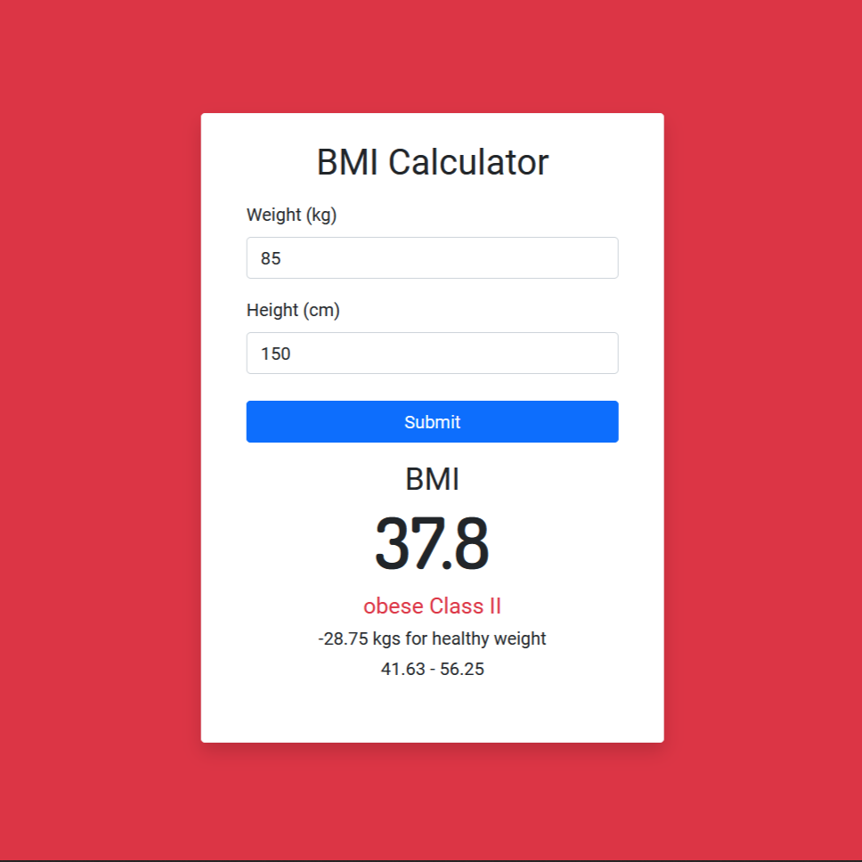

# BMI Calculator

Body mass index (BMI) is a value derived from the mass (weight) and height of a person. The BMI is defined as the body mass divided by the square of the body height, and is expressed in units of kg/m2, resulting from mass in kilograms and height in metres.

It is a simple React BMI Calculator app which takes height(cm) and weight(kg) of a person and returns BMI of that person.
## Demo

https://cal-bmi.herokuapp.com/
## Screenshots




## Built With

React, React-Bootstrap
## Run Locally

Clone the project

```bash
  git clone https://github.com/nandanholla/bmi-calculator.git
```

Install dependencies

```bash
  npm install
```

Start the server

```bash
  npm run start
```


## Authors

- [@nandanholla](https://www.github.com/nandanholla)


## Acknowledgements

 - [Bmi icons created by photo3idea_studio - Flaticon](https://www.flaticon.com/free-icons/bmi)
 

